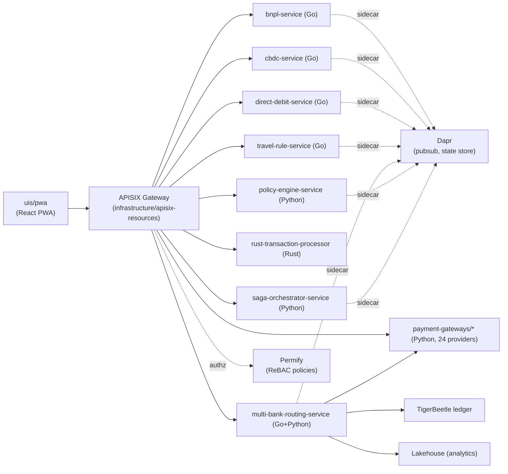

# Architecture

## System overview

## Services

Each service under `services/` is independently deployable and (mostly) independently versioned — there is currently no shared library layer, so cross-cutting changes (e.g. a shared Go HTTP middleware) are duplicated per service rather than imported from a common package. See the root [README.md](../README.md) for the full service list and per-language quick-start commands.

`multi-bank-routing-service` is the exception to the "one service, one language" pattern: it's Go for the routing/liquidity/reconciliation logic and Python for ML forecasting (`ml/`) and event/lakehouse integration (`kafka_events.py`, `lakehouse_integration.py`).

## Infrastructure

- **Kubernetes**: DigitalOcean-managed cluster, namespace `54remit`.
- **Helm**: one chart per service under `infrastructure/charts/`, generated from `infrastructure/templates/template-chart` via `infrastructure/00_provision_chart.sh`. This differs deliberately from a single umbrella chart — it lets each service version and roll back independently.
- **APISIX**: API gateway in front of all services (`infrastructure/apisix-resources/`), including a custom Lua plugin for JWT/tenant/Keycloak resolution (`apisix-resources/plugins/access.lua`).
- **Dapr**: sidecar per service for pub/sub and state store access (`infrastructure/manifests/dapr/pubsub.yaml`).
- **Permify**: relationship-based access control policies (`infrastructure/integration/permify_policies/`), with operational scripts for testing and rolling out policy changes across pods.

## CI/CD

- `.github/workflows/ci.yml` — per-language lint/build/test, run on every push and PR.
- `.github/workflows/security-scanning.yml` — secret scanning, static analysis, and dependency vulnerability audits per language.
- `.github/workflows/deploy.yml` — builds and pushes container images, then `helm upgrade --install`s every chart under `infrastructure/charts/`.

Not every service has a Dockerfile or Helm chart yet (see `deploy.yml`'s comments for current coverage) — adding both is a prerequisite for a service to be included in the deploy pipeline.
