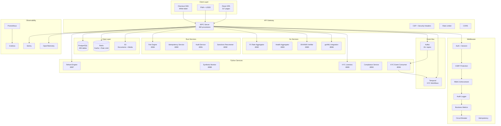
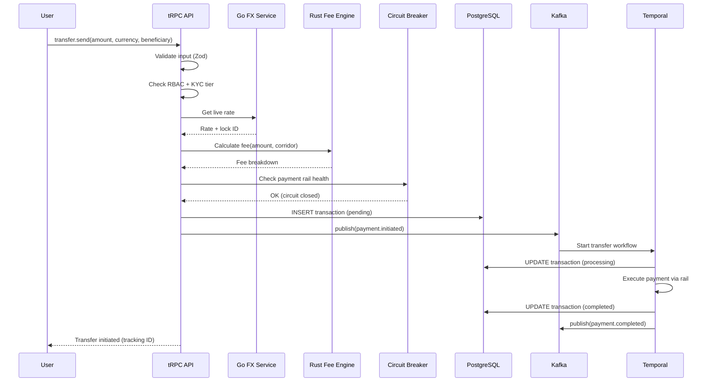

# RemitFlow Architecture

## System Overview

RemitFlow is a polyglot microservices platform for African remittances, built with:
- **TypeScript/Node.js**: API server (tRPC), 317 frontend pages (React)
- **Go**: FX aggregation, health monitoring, BVN/NIN verification, goAML integration
- **Rust**: Fee engine, idempotency service, audit service, sanctions re-screening
- **Python**: Refund engine, synthetic monitoring, KYC liveness, compliance service

## Architecture Diagram

## Data Flow: Transfer

## Service Boundaries

| Domain | Language | Why |
|--------|----------|-----|
| API + Frontend | TypeScript | Type safety across client/server boundary |
| FX Aggregation | Go | Low-latency concurrent HTTP calls to rate providers |
| Fee Calculation | Rust | Sub-millisecond math, zero-allocation hot path |
| Refund Processing | Python | Complex business rules, rapid iteration |
| KYC Liveness | Python | ML model integration (MiniFASNet, PaddleOCR) |
| Audit Service | Rust | High-throughput append-only log, tamper detection |
| Sanctions | Rust | OFAC list matching — performance-critical fuzzy search |

## Database Schema

- **262 tables** defined in Drizzle ORM schema
- **50+ relations** for type-safe JOINs
- **Row-Level Security** on 6 sensitive tables
- **Full-text search** via GIN indexes on 6 tables
- **Soft deletes** on 10 critical tables

## Deployment

- **Kubernetes (EKS)**: 3-20 nodes, HPA auto-scaling
- **Terraform**: Full IaC for EKS, RDS Multi-AZ, ElastiCache, S3, VPC
- **GitOps**: Staging → Production via GitHub Actions
- **Docker**: 72+ services with health checks
