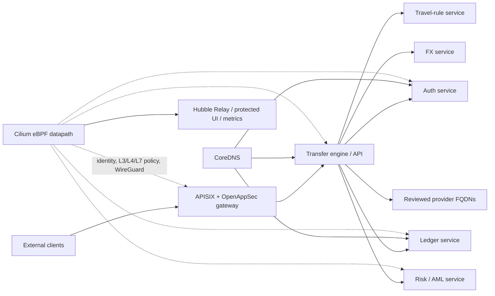

# RemitFlow Cilium and eBPF Security Layer

This directory adds a **Kubernetes-only** Cilium integration to RemitFlow. It is intentionally separate from `docker-compose.platform.yml`: Cilium is a Kubernetes CNI and eBPF data-plane implementation, whereas the Compose stack remains the local and single-host integration environment. The platform already contains Helm charts for its service estate, making a Cilium policy layer directly useful once that estate is deployed to Kubernetes.

> **Safety boundary.** Do not replace a live cluster CNI, enable kube-proxy replacement, or turn on strict policy enforcement without following the staged rollout below. Cilium documents that changing kube-proxy handling on a running cluster breaks existing service connections, and policy-audit mode itself is not a production enforcement mode.[1][2]

| Platform requirement | Cilium/eBPF implementation in this repository | Security or operational benefit |
|---|---|---|
| East-west confidentiality | `values.production.yaml` enables WireGuard and node encryption. | Encrypts Cilium-managed traffic between nodes while preserving Kubernetes workload identity.[3] |
| Service identity and least privilege | All 74 Helm charts now emit `app.kubernetes.io/part-of: remitflow`; the policy chart targets an explicit `security.remitflow.io/network-policy: strict` label. | Policies are stable across release names and cannot silently cover an unreviewed workload. |
| API segmentation | `remitflow-cilium-security` renders gateway-to-API and API-to-core-service L4 rules. | Limits access to declared internal service ports rather than relying on namespace-wide trust. |
| External egress control | The policy chart permits only explicitly reviewed `externalFQDNs`, with a required DNS rule. | Supports provider allow-listing without hard-coding mutable IP addresses.[4] |
| Network observability | Hubble Relay, UI, policy correlation, OpenMetrics, and sensitive HTTP metadata redaction are enabled. | Produces a cluster-wide service map and policy verdict evidence without exposing request secrets.[5] |
| Operational resilience | Two Cilium operator and Hubble Relay replicas, configuration-drift detection, BPF drop and policy verdict telemetry. | Reduces single-pod control-plane risk and makes policy/datapath drift observable. |



## Delivered artifacts

| Path | Purpose |
|---|---|
| `values.production.yaml` | Pinned Cilium 1.19.6 production overlay. It enables eBPF masquerading, WireGuard encryption, Hubble, sensitive-flow redaction, and safe default kube-proxy posture. |
| `values.kube-proxy-replacement.yaml.example` | **New-cluster-only** overlay for the eBPF kube-proxy replacement. It requires an explicit API endpoint and must not be applied to a live kube-proxy cluster. |
| `../charts/remitflow-cilium-security` | Helm chart that renders the opt-in zero-trust policy set. |
| `scripts/reconcile_chart_labels.py` | Reconciles the shared RemitFlow identity label across Helm charts; it was applied to all current charts. |
| `scripts/validate.sh` | Static and Helm render validation. |
| `scripts/deploy.sh` | Safe Cilium and policy-chart installation, intentionally observation-first. |
| `scripts/verify.sh` | Live-cluster acceptance verification for Cilium, Hubble, WireGuard, and strict policy state. |

## Deployment prerequisites

Cilium requires Kubernetes configured for a CNI and Linux nodes with a supported kernel; the current official generic installation guidance specifies Linux kernel 5.10 or newer.[1] WireGuard node encryption additionally requires kernel WireGuard support and node-to-node UDP/51871 reachability.[3]

The following tools and permissions are required in a real cluster environment: `kubectl`, Helm 3, cluster-admin rights for Cilium installation, and the ability to create Cilium CRDs. The sandbox used for repository validation has no Kubernetes cluster, so deployment commands are included but have not been run against live infrastructure.

Before installation, select **one** supported Cilium routing/IPAM model for the target environment. This repository intentionally does not hard-code cloud-specific ENI, VPC, GKE, AKS, or pod CIDRs. That prevents a generic repository change from corrupting routing on a different provider.

## Staged rollout

The implementation uses a mandatory staged rollout rather than immediately enforcing default deny.

1. Run `scripts/validate.sh` locally or in CI.
2. Install Cilium and the policy chart in observation mode with `scripts/deploy.sh`. Strict policies are not rendered while `enforcement.enabled=false`.
3. For one selected non-critical workload, apply the `security.remitflow.io/network-policy=strict` label and temporarily enable endpoint-level or daemon-level policy audit mode. Observe Hubble policy verdicts and enumerate every expected service, DNS, and provider flow.[2]
4. Extend `coreServices` and `externalFQDNs` in a reviewed values file until Hubble reports no unexplained audited denies.
5. Disable policy audit mode, set `enforcement.enabled=true`, and roll out the strict label gradually, beginning with API-facing workloads. Keep the Hubble dashboard internal and require authenticated administrative access.
6. Only for a **new cluster**, evaluate the kube-proxy replacement overlay. Cilium warns that changing it on an existing running cluster breaks service connections.[6]

The default policy chart allows gateway-to-API, API-to-listed-core-service, DNS, health probes, and reviewed FQDN egress. It intentionally does not add a broad intra-namespace allow rule, because such a rule would defeat the zero-trust objective.

## Values that require environment-specific review

The base values file is safe by default, but the following settings require a platform operator to decide them per cluster:

| Setting | Default in this implementation | Operator action |
|---|---|---|
| `routingMode`, `tunnelProtocol`, and IPAM | Unset. | Choose according to the Kubernetes distribution and network topology. |
| `encryption.strictMode.egress` | Disabled. | Enable only with the actual non-overlapping IPv4 Pod CIDR after validating encrypted traffic. |
| `kubeProxyReplacement` | `false`. | Use only on a new cluster or a planned, tested migration. |
| `externalFQDNs` | Empty. | Add reviewed payment, KYC, regulatory, SMS, and FX provider FQDNs with explicit ports. |
| `enforcement.enabled` | `false`. | Turn on only after Hubble audit evidence and policy review. |

## Commands

```bash
# Validate static artifacts and render the policy chart.
infrastructure/cilium/scripts/validate.sh

# Install Cilium in safe observation mode.
KUBECONFIG=/path/to/kubeconfig \
REMITFLOW_NAMESPACE=banking \
infrastructure/cilium/scripts/deploy.sh

# After policy audit and approval, apply a reviewed production override.
KUBECONFIG=/path/to/kubeconfig \
REMITFLOW_NAMESPACE=banking \
STRICT_POLICY_VALUES=/secure/path/remitflow-cilium-policy-production.yaml \
ENABLE_STRICT_POLICY_ENFORCEMENT=true \
infrastructure/cilium/scripts/deploy.sh

# Check Cilium, Hubble, WireGuard, and strict policy status.
KUBECONFIG=/path/to/kubeconfig \
REMITFLOW_NAMESPACE=banking \
infrastructure/cilium/scripts/verify.sh
```

## References

[1]: https://docs.cilium.io/en/stable/installation/k8s-install-helm/ "Cilium: Installation using Helm"
[2]: https://docs.cilium.io/en/stable/security/policy-creation/ "Cilium: Creating Policies from Verdicts"
[3]: https://docs.cilium.io/en/stable/security/network/encryption-wireguard/ "Cilium: WireGuard Transparent Encryption"
[4]: https://docs.cilium.io/en/stable/security/dns/ "Cilium: Locking Down External Access with DNS-Based Policies"
[5]: https://docs.cilium.io/en/stable/observability/hubble/ "Cilium: Network Observability with Hubble"
[6]: https://docs.cilium.io/en/stable/network/kubernetes/kubeproxy-free/ "Cilium: Kubernetes Without kube-proxy"
